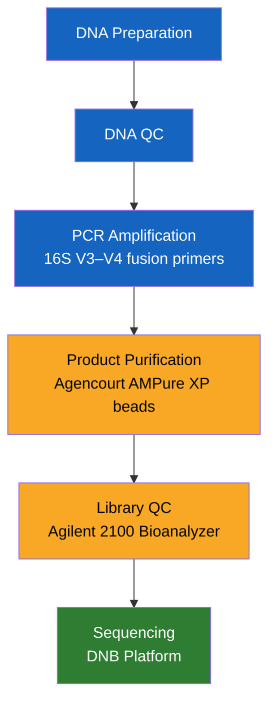
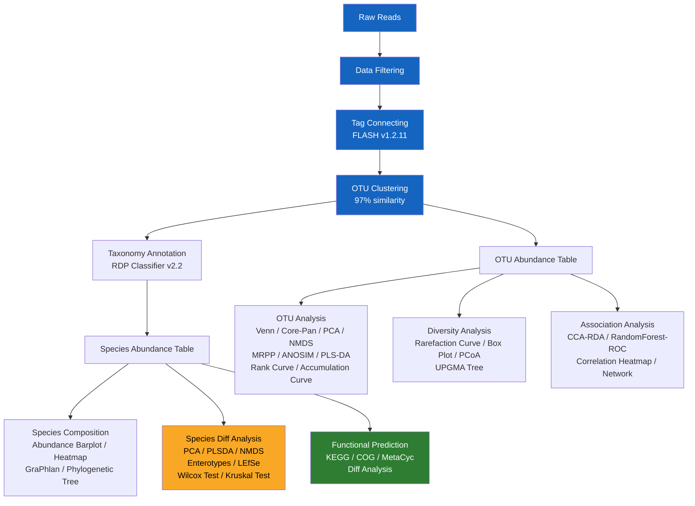
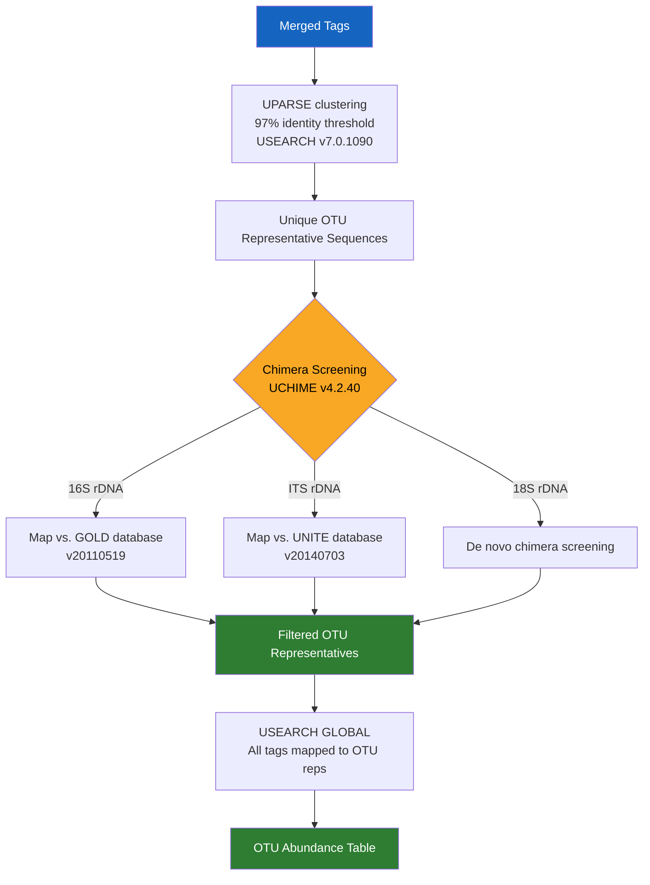
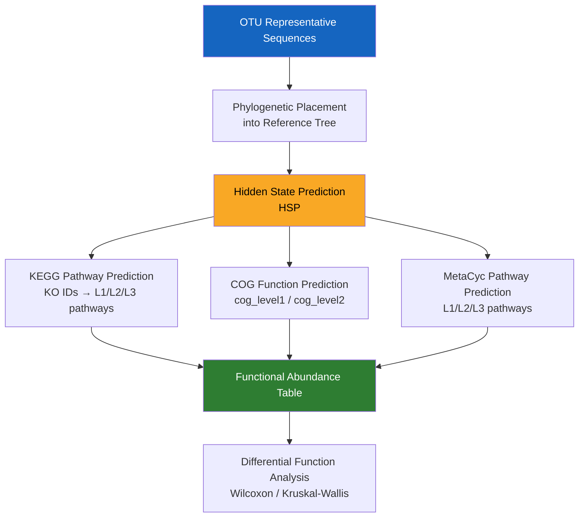

# BGI Amplicon Project Report
**Date:** 2025-04-22  
**Project ID:** F25A430000203\_BACtqyoM  
**Provider:** BGI Genomics (华大基因)

---

## Table of Contents

**Results**
1. [Item Information](#1-item-information)
2. [Introduction of Experiment Workflow](#2-introduction-of-experiment-workflow)
3. [Bioinformatics Analysis Workflow](#3-bioinformatics-analysis-workflow)
4. [Data Filtering](#4-data-filtering)
5. [Tags Connection](#5-tags-connection)
6. [OTU Clustering](#6-otu-clustering)
7. [Species Composition and Abundance](#7-species-composition-and-abundance)
8. [Diversity Analysis (Alpha)](#8-diversity-analysis-alpha)
9. [Beta Diversity Analysis](#9-beta-diversity-analysis)
10. [Analysis of Differential Species](#10-analysis-of-differential-species)
11. [Function Prediction](#11-function-prediction)
12. [Correlation Analysis and Model Prediction](#12-correlation-analysis-and-model-prediction)

**Methods**
- [M1. Experiment Workflow](#m1-experiment-workflow)
- [M2. Bioinformatics Workflow](#m2-bioinformatics-workflow)
- [M3. Data Filtering](#m3-data-filtering)
- [M4. Tags Connection](#m4-tags-connection)
- [M5. OTU Clustering](#m5-otu-clustering)
- [M6. Species Composition and Abundance](#m6-species-composition-and-abundance)
- [M7. Diversity Analysis](#m7-diversity-analysis)
- [M8. Beta Diversity Analysis](#m8-beta-diversity-analysis)
- [M9. Differential Analysis](#m9-differential-analysis)
- [M10. Function Prediction](#m10-function-prediction)
- [M11. Correlation Analysis and Model Prediction](#m11-correlation-analysis-and-model-prediction)

**Appendices**
- [Help / Technical Support](#help--technical-support)
- [FAQs](#faqs)
- [References](#references)

---

## Results

---

### 1 Item Information

**Table 1 — Project Summary**

| ProjectInfo | Description |
|---|---|
| Project\_ID | F25A430000203\_BACtqyoM |
| Region | 16S-V3-V4 |
| TagNumber | 50,000 |
| Database | RDP |
| SampleNumber | 51 |

---

### 2 Introduction of Experiment Workflow

30 ng of qualified DNA template and the 16S rRNA fusion primers are added for Polymerase Chain Reaction (PCR). All PCR products are purified by Agencourt AMPure XP beads, dissolved in Elution Buffer, and eventually labeled to complete library construction. Library size and concentration are assessed by Agilent 2100 Bioanalyzer. Qualified libraries are sequenced on the DNB platform according to their insert size.



**Figure 1. Introduction of Experiment Workflow.**

---

### 3 Bioinformatics Analysis Workflow

Raw data are filtered to obtain high-quality clean reads, after which clean reads that overlap with each other are merged to tags and further clustered to OTU. Taxonomic classifications are assigned to OTU representative sequences using the Ribosomal Database Project (RDP) database. Downstream analyses including alpha diversity, beta diversity, differential species analysis, network analysis, and model prediction are all carried out on the basis of the OTU profile table and taxonomic annotation results.



**Figure 2. Bioinformatics Analysis Workflow.**

---

### 4 Data Filtering

Raw reads are filtered to generate high-quality clean reads following this four-step protocol:

1. **Sliding-window quality truncation:** Reads whose average Phred quality score falls below Q20 within a 25 bp sliding window are truncated. Reads whose post-truncation length is less than 75% of the original length are discarded.
2. **Adapter contamination removal:** Reads contaminated by adapter sequences are removed (default: 15 bp overlap between read and adapter, ≤ 3 base mismatches allowed). *(Software: cutadapt v2.6)*
3. **Ambiguous base removal:** Reads containing N bases are discarded.
4. **Low-complexity filtering:** Reads with ≥ 10 consecutive identical bases are removed.

To ensure complete removal of barcode sequences from pooled libraries, clean reads are assigned to corresponding samples via exact-match alignment (0-base-mismatch) against barcode sequences using in-house scripts.

**Software stack:**

| Tool | Version | Purpose |
|---|---|---|
| iTools Fqtools fqcheck | v0.25 | Quality statistics |
| cutadapt | v2.6 | Adapter trimming |
| readfq | v1.0 | FASTQ parsing |

**Output file paths:**
```
BGI_Result/Cleandata/
├── *_1.fq.gz          # Filtered Read 1
├── *_2.fq.gz          # Filtered Read 2
└── CleanData_stat.xls # Filtering statistics table
```

**Table 2 — Data Filtering Statistics (partial)**

| #SampleName | ReadsLength (bp) | RawData (Mbp) | NBase (%) | PloyBase (%) | LowQuality (%) | CleanData (Mbp) | DataUtilizationRatio (%) |
|---|---|---|---|---|---|---|---|
| CS1 | 300:300 | 46.278 | 8.160 | 0.003 | 0.080 | 37.50 | 81.03 |
| CS2 | 300:300 | 46.970 | 10.761 | 0.007 | 0.069 | 36.11 | 76.88 |
| CS3 | 300:300 | 93.773 | 9.419 | 0.004 | 0.072 | 75.00 | 79.98 |
| CT1 | 300:300 | 46.473 | 8.361 | 0.012 | 0.095 | 37.50 | 80.69 |
| CT2 | 300:300 | 44.060 | 6.286 | 0.009 | 0.104 | 37.50 | 85.11 |
| CT3 | 300:300 | 45.933 | 7.764 | 0.007 | 0.099 | 37.50 | 81.64 |
| GBFA1 | 300:300 | 46.930 | 8.789 | 0.010 | 0.148 | 37.50 | 79.91 |
| GBFA2 | 300:300 | 46.053 | 7.790 | 0.004 | 0.153 | 37.50 | 81.43 |
| GBFA3 | 300:300 | 48.903 | 10.435 | 0.004 | 0.170 | 37.50 | 76.68 |
| GBFB1 | 300:300 | 48.911 | 10.389 | 0.006 | 0.186 | 37.50 | 76.67 |
| GBFB2 | 300:300 | 46.353 | 8.085 | 0.012 | 0.156 | 37.50 | 80.90 |
| GBFB3 | 300:300 | 47.023 | 8.846 | 0.005 | 0.158 | 37.50 | 79.75 |
| GCF1 | 300:300 | 49.190 | 10.751 | 0.005 | 0.118 | 37.50 | 76.24 |
| GCF2 | 300:300 | 49.140 | 10.843 | 0.004 | 0.172 | 37.50 | 76.31 |
| GCF3 | 300:300 | 46.164 | 7.955 | 0.005 | 0.119 | 37.50 | 81.23 |
| GCFBF1 | 300:300 | 49.412 | 10.810 | 0.006 | 0.166 | 37.50 | 75.89 |
| GCFBF2 | 300:300 | 49.321 | 11.037 | 0.005 | 0.149 | 37.50 | 76.03 |
| GCFBF3 | 300:300 | 49.359 | 10.774 | 0.005 | 0.144 | 37.50 | 75.97 |
| GCK1 | 300:300 | 46.941 | 8.903 | 0.008 | 0.136 | 37.50 | 79.89 |
| GCK2 | 300:300 | 84.181 | 10.488 | 0.004 | 0.131 | 65.57 | 77.89 |

> **Note:** Table 2 is truncated here to 20 representative samples; the full table (51 samples) is available in `BGI_Result/Cleandata/CleanData_stat.xls`.

---

### 5 Tags Connection

If paired-end reads overlap with each other, a consensus sequence (tag) is generated using FLASH (*Fast Length Adjustment of Short Reads*, v1.2.11). Merging parameters:

- Minimum overlapping length: **15 bp**
- Maximum mismatching ratio in the overlapping region: **≤ 0.10**

**Software:** FLASH v1.2.11

**Table 3 — Tags Connection Statistics (partial)**

| #SampleName | TotalPairsReadNumber | ConnectTagNumber | ConnectRatio (%) | AverageLengthAndSD |
|---|---|---|---|---|
| CS1 | 69,534 | 53,117 | 76.39 | 422/10 |
| CS2 | 66,167 | 52,436 | 79.25 | 418/11 |
| CS3 | 137,006 | 97,218 | 70.96 | 423/10 |
| CT1 | 69,075 | 55,831 | 80.83 | 413/10 |
| CT2 | 69,138 | 56,441 | 81.64 | 413/10 |
| CT3 | 69,500 | 54,972 | 79.10 | 413/10 |
| GBFA1 | 69,051 | 54,654 | 79.15 | 412/10 |
| GBFA2 | 69,166 | 55,190 | 79.79 | 412/10 |
| GBFA3 | 69,255 | 53,429 | 77.15 | 412/10 |
| GBFB1 | 69,455 | 50,280 | 72.39 | 414/11 |
| GBFB2 | 69,491 | 52,326 | 75.30 | 413/10 |
| GBFB3 | 69,772 | 51,453 | 73.74 | 415/11 |
| GCF1 | 69,520 | 51,536 | 74.13 | 416/11 |
| GCF2 | 69,799 | 51,808 | 74.22 | 415/11 |
| GCF3 | 69,931 | 53,092 | 75.92 | 412/10 |
| GCFBF1 | 70,000 | 51,013 | 72.88 | 414/10 |
| GCFBF2 | 69,968 | 50,667 | 72.41 | 417/11 |
| GCFBF3 | 69,224 | 52,561 | 75.93 | 413/11 |
| GCK1 | 69,189 | 54,520 | 78.80 | 412/10 |
| GCK2 | 121,039 | 72,727 | 60.09 | 424/9 |

**Output file paths:**
```
BGI_Result/Tag/
├── *FinalTag.fa.gz         # Merged tag sequences (FASTA)
└── ConnectTags_stat.xls    # Tag connection statistics table
```

---

### 6 OTU Clustering

**OTU (Operational Taxonomic Units)** are defined as unified markers for analysing taxon units across seven taxonomy levels (Kingdom → Phylum → Class → Order → Family → Genus → Species) in the context of phylogenetics and population genetics. Sequences are clustered at **97% identity** to quantify bacterial abundance at each level in each sample.

#### OTU Clustering Pipeline



**Software:**

| Tool | Version | Purpose |
|---|---|---|
| USEARCH | v7.0.1090 | OTU clustering (UPARSE algorithm) |
| UCHIME | v4.2.40 | Chimera detection and removal |

#### OTU Taxonomy Annotation

OTU representative sequences are aligned against the reference database for taxonomic annotation using **RDP Classifier (v2.2)** with a sequence identity threshold of **0.6**.

**Reference databases:**

| Marker | Database | Version |
|---|---|---|
| 16S (bacteria + archaea) | Greengenes | V202210 (default) |
| 16S (bacteria + archaea) | RDP | Release 19, 2023-07-20 |
| 18S fungi | SILVA | V138, 2019-12-16 |
| ITS fungi | UNITE | Version 10, 2024-04-04 |

**Post-annotation filtering:**
1. Remove OTUs that cannot be annotated.
2. Remove taxonomic assignments inconsistent with the project's research background (e.g., for 16S bacteria samples, all OTUs annotated as Archaea are excluded; remaining OTUs are used for downstream analysis).

**Table 4 — OTU Statistics (partial)**

| Sample Name | Tag Number | OTU Number |
|---|---|---|
| CS1 | 30,647 | 1,149 |
| CS2 | 44,735 | 806 |
| CS3 | 45,834 | 558 |
| CT1 | 33,358 | 2,085 |
| CT2 | 31,177 | 1,953 |
| CT3 | 29,651 | 2,214 |
| GBFA1 | 31,331 | 2,328 |
| GBFA2 | 32,855 | 2,179 |
| GBFA3 | 34,276 | 2,480 |
| GBFB1 | 33,093 | 1,449 |
| GBFB2 | 29,380 | 2,397 |
| GBFB3 | 31,208 | 1,869 |
| GCF1 | 35,363 | 1,188 |
| GCF2 | 36,825 | 1,965 |
| GCF3 | 32,813 | 2,147 |
| GCFBF1 | 34,068 | 1,590 |
| GCFBF2 | 36,910 | 1,993 |
| GCFBF3 | 33,015 | 1,553 |
| GCK1 | 31,730 | 2,246 |
| GCK2 | 34,029 | 450 |

**Output file paths:**
```
BGI_Result/OTU/
├── OTU_final.fasta          # Representative OTU sequences
├── OTU_taxonomy.xls         # Species annotation results
├── OTU_table_for_biom.txt   # OTU abundance per sample (BIOM-compatible)
├── OTU.shared.xls           # OTU abundance per sample (Excel)
└── OTU_stat_detail.xls      # Detailed species annotation results
```

**Table 5 — OTU Taxonomy Annotation Examples (partial)**

| #OTUId | Abundance | Taxonomy |
|---|---|---|
| Otu4056 | 15 | Bacteria; Pseudomonadota; Deltaproteobacteria |
| Otu4057 | 7 | Bacteria |
| Otu4054 | 28 | Bacteria |
| Otu3824 | 6 | Bacteria; Pseudomonadota; Deltaproteobacteria; Bdellovibrionales; Bdellovibrionaceae; *Bdellovibrio*; *B. bacteriovorus* |
| Otu4052 | 5 | Bacteria; Candidatus Saccharibacteria; Unclassified; Saccharibacteria |
| Otu4053 | 28 | Bacteria; Chloroflexota; Caldilineae; Caldilineales; Caldilineaceae; *Litorilinea*; *L. aerophila* |
| Otu4050 | 9 | Bacteria; Pseudomonadota; Deltaproteobacteria; Desulfuromonadales |
| Otu4051 | 7 | Bacteria; Armatimonadota; Unclassified; Armatimonadetes\_gp4 |
| Otu4537 | 3 | Bacteria; Pseudomonadota; Alphaproteobacteria; Hyphomicrobiales |
| Otu3822 | 4 | Bacteria; Planctomycetota; Phycisphaerae; Phycisphaerales; Phycisphaeraceae |
| Otu4058 | 8 | Bacteria; Chlamydiota; Chlamydiia; Chlamydiales; Parachlamydiaceae; *Parachlamydia*; *P. acanthamoebae* |
| Otu4059 | 11 | Bacteria; Pseudomonadota; Deltaproteobacteria; Myxococcales; Sandaracinaceae; *Sandaracinus*; *S. amylolyticus* |
| Otu4588 | 79 | Bacteria; Bacillota; Bacilli; Caryophanales; Paenibacillaceae; *Cohnella*; *C. yongneupensis* |
| Otu4589 | 11 | Bacteria; Verrucomicrobiota |
| Otu5053 | 4 | Bacteria; Synergistota; Synergistia; Synergistales; Synergistaceae; *Pyramidobacter*; *P. piscolens* |
| Otu4055 | 11 | Bacteria; Campylobacterota; Campylobacteria; Campylobacterales; Helicobacteraceae; *Sulfurimonas*; *S. autotrophica* |
| Otu5055 | 2 | Bacteria; Chlamydiota; Chlamydiia; Chlamydiales |
| Otu5054 | 8 | Bacteria; Actinomycetota; Actinobacteria; Propionibacteriales; Actinopolymorphaceae; *Actinopolymorpha* |
| Otu5057 | 2 | Bacteria |
| Otu5056 | 4 | Bacteria; Pseudomonadota; Deltaproteobacteria; Myxococcales |

#### OTU Venn Map (2–5 samples or groups)

Venn diagrams display the number of OTUs shared or unique across up to five samples or groups, enabling identification of the core microbiome across different environments.

**Software:** R v3.1.1 (VennDiagram package)

> **Interpretation:** Numbers in non-overlapping areas = sample/group-unique OTUs; numbers in overlapping areas = shared OTUs.

**Output file paths:**
```
BGI_Result/Venn/
├── *.venn.PNG              # Venn diagram (PNG)
└── *sharedOTU.venn.xls     # Common/unique OTU IDs per sample/group
```

#### Core-Pan OTU Plot

The Core-Pan OTU plot (flower plot) visualises shared (core) and unique (pan) OTUs across samples or groups — analogous to a Venn diagram but supporting up to 5 groups simultaneously. The central circle represents shared OTUs; outer ellipses represent group-specific OTUs.

**Software:** R v3.1.1

**Output file paths:**
```
BGI_Result/Flower/
├── *.Flower.PDF
└── *.Flower.PNG
```

#### OTU PCA Analysis

Principal Components Analysis (PCA) of OTU abundance profiles reduces dimensionality to reveal the primary axes of variance among samples. Points in different colours/shapes denote samples from different environments or conditions. PC1 and PC2 represent the major sources of microbial community variation.

**Software:** R v3.1.1 (ade package)

> **Interpretation:** If two groups of samples separate along PC1, then PC1 represents the dominant factor driving microbial community shifts. Axis scale values are relative distances with no absolute biological meaning.

**Output file paths:**
```
BGI_Result/PCA/
├── OTU.PCA*.group.xls          # Group information for PCA
├── OTU.PCA*.otu.xls            # OTU abundance profiles used in PCA
├── OTU.PCA*.PCA.PC1PC2.PDF
└── OTU.PCA*.PCA.PC1PC2.PNG
```

#### OTU NMDS Analysis

Non-Metric Multidimensional Scaling (NMDS) simplifies high-dimensional microbial community data into low-dimensional ordination space while preserving pairwise distance relationships. NMDS stress value < 0.2 indicates an acceptable representation.

**Software:** R v3.1.1 (vegan package)

**Output file paths:**
```
BGI_Result/NMDS/
├── *.NMDS.PNG
├── *.NMDS.PDF
└── *.NMDS.xls       # Sample coordinate positions
```

#### OTU MRPP Analysis

Multiple Response Permutation Procedure (MRPP) tests whether significant compositional differences exist between two or more groups of sampling units, calculated on Bray-Curtis distances. MRPP generates an **A statistic** (effect size) and a **p-value** from a permutation test.

**Software:** R v3.5.1 (vegan package)

**Table 6 — OTU MRPP Results**

| Group | Distance | A | Observe\_delta | Expect\_delta | P\_value |
|---|---|---|---|---|---|
| A-B-C-D-E-F-G-H-I-J-K-L-M-N-O-P-Q | bray | 0.169 | 0.5148 | 0.6196 | 0.001 |

> **Interpretation:** A > 0 → between-group differences exceed within-group differences. A < 0 → within-group differences dominate. P < 0.05 indicates statistically significant group separation.

**Output file paths:**
```
BGI_Result/SimilarityAnalysis/1.MRPP/
└── *.MRPP.xls
```

#### OTU ANOSIM Analysis

Analysis of Similarities (ANOSIM) is a non-parametric test for high-dimensional ecology data, based on Bray-Curtis dissimilarity rankings. ANOSIM generates an **R statistic** (−1 to 1) and p-value.

**Software:** R v3.5.1 (vegan package)

> **Interpretation:** R > 0 → between-group > within-group differences; R < 0 → within-group > between-group differences. The larger |R|, the greater the relative differentiation. P < 0.05 indicates significance.

**Output file paths:**
```
BGI_Result/SimilarityAnalysis/2.Anosim/
├── *.Anosim.xls
├── *.Anosim.pdf
└── *.Anosim.png
```

#### Species Accumulation Curve

Species accumulation curves plot OTU count (Y-axis) against cumulative sample number (X-axis). They evaluate whether sampling depth is sufficient to capture the full microbial diversity in the ecosystem. A curve that plateaus indicates adequate sampling; a curve that continues to rise steeply suggests additional samples are needed.

**Software:** R v3.2.1

**Output file paths:**
```
BGI_Result/Cumulative_Curve/
├── Cumulative_Curve.PDF
└── Cumulative_Curve.PNG
```

#### OTU PLS-DA

Partial Least Squares Discriminant Analysis (PLS-DA; Barker & Rayens, 2003) is a supervised linear classification model that maximises group separation by combining the functions of PCA and multiple regression. Unlike unsupervised PCA, PLS-DA is group-label aware, providing more discriminating separation between defined sample classes.

**Software:** R v3.2.1 (mixOmics package)

**Output file paths:**
```
BGI_Result/PLSDA/
├── *.PLSDA.PDF
└── *.PLSDA.PNG
```

#### OTU Rank Curve

OTU rank curves visualise two complementary facets of diversity simultaneously:
- **Species richness** — the horizontal extent of the curve (wider = richer).
- **Species evenness** — the slope of the curve (flatter = more even).

The relative abundance of each OTU is ranked in descending order, plotted on a log-scale Y-axis against OTU rank on the X-axis.

**Software:** R v3.1.1

**Output file paths:**
```
BGI_Result/OTU_Rank/
├── *.OTU_rank.PDF
└── *.OTU_rank_percent.xls
```

---

### 7 Species Composition and Abundance

Taxonomic analysis of OTU representative sequences is performed using the RDP Classifier Bayesian algorithm to reconstruct the full microbial community composition. Abundance is calculated at seven hierarchical levels: **Phylum → Class → Order → Family → Genus → Species**.

#### Species Abundance Barplot

Stacked bar plots display the relative compositional profile of each sample or group. Species with relative abundance < 0.5% are consolidated into an "Others" category.

**Software:** R v3.4.1

> **Output:** Barplots are produced at all seven taxonomic levels in both sample-level and group-level formats (PDF + PNG).

**Output file paths:**
```
BGI_Result/Barplot/
├── classification_level.*.{PDF,PNG}              # Group-level barplots
├── Barplot.Sample.classification_level.*.{PDF,PNG} # Sample-level barplots
├── Group.classification_level*.Barplot.xls
└── Sample.classification_level*.Barplot.xls
```

#### Species Heatmap

Hierarchically clustered heatmaps display species relative abundance across all samples using log₁₀ transformation for normalisation. Samples with zero relative abundance for a species are assigned half the minimum abundance value. Euclidean distance with complete-linkage clustering is applied.

**Software:** R v3.1.1 (gplots package; complete clustering, Euclidean distance)

> **Interpretation:** Horizontal clusters indicate co-abundance patterns across samples. Shorter branch lengths imply greater similarity.

**Output file paths:**
```
BGI_Result/Heatmap/
├── Sample.*.classification_level.Heatmap.log10.xls
├── Group.*.classification_level.Heatmap.log10.xls
├── Heatmap.Cluster.Sample.*.classification_level.{PDF,PNG}
└── Heatmap.Cluster.Group.*.classification_level.{PDF,PNG}
```

#### Species GraPhlan Map

GraPhlAn generates high-quality circular cladograms for phylogenetic and taxonomic trees, integrating abundance data as node sizes and phylum-level colour coding across five concentric rings (phylum → class → order → family → genus).

**Software:** GraPhlAn (https://huttenhower.sph.harvard.edu/graphlan)

> **Ring key (inner → outer):** Phylum | Class | Order | Family | Genus. Node size = genus abundance.

**Output file paths:**
```
BGI_Result/Graphlan/
├── *.group.final.anno.txt     # GraPhlAn annotation file
├── *.group.{PDF,PNG}          # Group-level cladogram
└── *sample/                   # Sample-level plots
    ├── *.sample.final.anno.txt
    └── *.sample.{PDF,PNG}
```

#### Species Phylogenetic Analysis

Phylogenetic trees are constructed from OTU representative sequences using the approximately-maximum-likelihood algorithm in FastTree. The branching topology reflects evolutionary relationships among detected taxa derived from common ancestors.

**Software:** FastTree v2.1.3 (http://www.microbesonline.org/fasttree); visualisation in R v3.1.1

**Output file paths:**
```
BGI_Result/Genus_Tree/
├── genus.phylogeny.tree       # Newick tree file
├── genus.tree.PDF
└── genus.tree.PNG
```

#### Species PCA Analysis

PCA of species-level (taxonomic) abundance profiles, analogous to the OTU PCA described above but operating on annotated species-level abundance tables rather than raw OTU counts.

**Software:** R v3.1.1 (ade4 package)

#### Analysis of Flora Typing (Enterotyping)

Flora typing identifies dominant microbiome structural patterns independent of external environmental factors by statistical clustering of genus-level abundance data. Dissimilarity is quantified by Jensen-Shannon Distance (JSD), clustering performed by PAM (Partitioning Around Medoids), and optimal cluster number $K$ determined by the Calinski-Harabasz (CH) index.

$$\text{JSD}(P \| Q) = \frac{1}{2} D_{\text{KL}}(P \| M) + \frac{1}{2} D_{\text{KL}}(Q \| M), \quad M = \frac{P+Q}{2}$$

Visualisation uses Between-Class Analysis (BCA, $K \geq 3$) or PCoA ($K \geq 2$).

**Software:** R v3.4.1 (cluster + clusterSim packages)

**Output file paths:**
```
BGI_Result/Enterotypes/
├── *.JSD_hclust_3_eig.contribution.txt
├── *.JSD_hclust_3_Enterotype.{PDF,PNG}
├── *.JSD_hclust_3_Enterotypes.txt
├── *.JSD_hclust_3_species.PDF
└── *.JSD_hclust_3_Species_composition.top.30.{PDF,PNG}
```

---

### 8 Diversity Analysis (Alpha)

Alpha diversity quantifies intra-sample species richness, evenness, and library coverage. Six indices are reported:

| Index | What It Measures | Interpretation |
|---|---|---|
| **Sobs** (Observed Species) | Richness | Directly observed OTU count |
| **Chao1** | Richness (estimated) | Corrects for rare unseen taxa |
| **ACE** | Richness (estimated) | Abundance-based coverage estimator |
| **Shannon** ($H'$) | Diversity | Accounts for richness AND evenness |
| **Simpson** ($D$) | Dominance (inverse diversity) | Lower $D$ → higher diversity |
| **Good's Coverage** | Sequencing completeness | Higher → fewer undetected sequences |

$$H' = -\sum_{i=1}^{S} p_i \ln p_i \qquad D = 1 - \sum_{i=1}^{S} p_i^2$$

> **Note:** Chao1, ACE, and Sobs rarefaction curves assess whether sequencing depth is sufficient to capture all diversity — a plateau indicates adequacy.

**Software:** mothur v1.31.2

**Table 7 — Alpha Diversity Statistics (partial)**

| Sample\_Name | Sobs | Chao1 | ACE | Shannon | Simpson | Coverage |
|---|---|---|---|---|---|---|
| CS1 | 1,149 | 1,778.79 | 2,137.64 | 4.617 | 0.0301 | 0.9852 |
| CS2 | 806 | 1,149.50 | 1,217.50 | 4.025 | 0.0824 | 0.9949 |
| CS3 | 558 | 912.26 | 1,199.47 | 3.447 | 0.1335 | 0.9952 |
| CT1 | 2,085 | 2,975.65 | 2,926.39 | 5.593 | 0.0175 | 0.9778 |
| CT2 | 1,953 | 2,725.31 | 2,719.94 | 5.360 | 0.0223 | 0.9779 |
| CT3 | 2,214 | 2,840.52 | 2,877.69 | 6.025 | 0.0112 | 0.9773 |
| GBFA1 | 2,328 | 3,166.20 | 3,195.43 | 5.766 | 0.0196 | 0.9742 |
| GBFA2 | 2,179 | 3,043.61 | 3,086.89 | 5.505 | 0.0235 | 0.9761 |
| GBFA3 | 2,480 | 3,321.64 | 3,295.55 | 6.086 | 0.0106 | 0.9768 |
| GBFB1 | 1,449 | 1,996.36 | 2,355.91 | 4.994 | 0.0333 | 0.9849 |
| GBFB2 | 2,397 | 3,287.00 | 3,235.30 | 6.080 | 0.0120 | 0.9727 |
| GBFB3 | 1,869 | 2,644.45 | 2,634.36 | 5.552 | 0.0179 | 0.9788 |
| GCF1 | 1,188 | 1,822.06 | 2,305.55 | 3.460 | 0.1138 | 0.9853 |
| GCF2 | 1,965 | 2,975.10 | 2,933.46 | 4.295 | 0.0948 | 0.9788 |
| GCF3 | 2,147 | 3,113.04 | 3,091.71 | 5.365 | 0.0352 | 0.9753 |
| GCFBF1 | 1,590 | 2,267.05 | 2,245.07 | 4.972 | 0.0328 | 0.9834 |
| GCFBF2 | 1,993 | 2,855.56 | 2,828.04 | 4.490 | 0.0615 | 0.9800 |
| GCFBF3 | 1,553 | 2,284.28 | 2,762.32 | 4.964 | 0.0296 | 0.9815 |
| GCK1 | 2,246 | 3,085.40 | 3,093.99 | 5.694 | 0.0160 | 0.9749 |
| GCK2 | 450 | 820.92 | 1,171.58 | 2.092 | 0.3270 | 0.9932 |

#### Alpha Diversity Boxplot

Inter-group boxplots of each alpha diversity index provide direct visual comparison of diversity distributions across experimental groups. Statistical significance is evaluated by Wilcoxon Rank-Sum Test (two groups) or Kruskal-Wallis Test (≥ three groups).

**Software:** R v3.2.1

**Output file paths:**
```
BGI_Result/Alpha_Box/
├── *.Alpha.boxplot.{PDF,PNG}
├── *.Alpha.test.result.xls    # Wilcoxon/Kruskal-Wallis test results
└── *.Alpha.xls                # Raw alpha diversity index values
```

---

### 9 Beta Diversity Analysis

Beta diversity quantifies compositional dissimilarity between samples. Normalisation is first applied by randomly sub-sampling all samples to the minimum sequencing depth (rarefaction), yielding a normalised OTU BIOM table for all beta calculations.

**Software:** QIIME v1.80

**Beta diversity metrics available:**

| Metric | Considers Abundance | Considers Phylogeny | Notes |
|---|---|---|---|
| Bray-Curtis | Yes | No | Range: 0 (identical) → 1 (completely different) |
| Weighted UniFrac | Yes | Yes | Abundance-weighted phylogenetic distance |
| Unweighted UniFrac | No | Yes | Presence/absence phylogenetic distance |
| Pearson | Yes | No | Linear correlation-based dissimilarity |

$$d_{BC}(i,j) = \frac{\sum_k |X_{ik} - X_{jk}|}{\sum_k (X_{ik} + X_{jk})}$$

#### Beta Diversity Heatmap

Heatmaps visualise pairwise beta diversity distances across all samples, with hierarchical clustering to group samples with similar community compositions.

**Software:** R v3.1.1 (NMF package)

**Output file paths:**
```
BGI_Result/Beta/
└── {bray_curtis, unweighted_unifrac, weighted_unifrac}/
    └── *.{PDF,PNG}
```

#### Sample Clustering Tree

UPGMA (Unweighted Pair Group Method with Arithmetic Mean) clustering trees are constructed from the beta diversity distance matrices using 100-iteration bootstrapped resampling (75% of the minimum sample sequence count per iteration). Shorter branch lengths indicate higher microbial compositional similarity.

**Software:** QIIME v1.80; R v3.1.1

#### Beta Diversity Boxplot

Intra-group Bray-Curtis distances are extracted and compared across groups using Wilcoxon Rank-Sum (two groups) or Kruskal-Wallis (≥ three groups) tests.

**Table 8 — Beta Diversity Between-Group Statistics**

| Group | Median | Quantile | Statistic | P-value |
|---|---|---|---|---|
| A | 0.4056 | 0.0092 | 0 | 0.1 |
| B | 0.4685 | 0.0322 | — | — |

> **Interpretation:** P < 0.05 → significant difference in beta diversity between groups (i.e., groups differ in species composition).

#### Combination Graph of UPGMA Cluster Tree and Species Abundance Barplot

UPGMA clustering trees (Weighted/Unweighted UniFrac) are displayed side-by-side with species relative abundance barplots to contextualise compositional differences within the phylogenetic structure.

**Software:** phytools; R v3.5.1

#### PCoA Analysis

Principal Coordinates Analysis (PCoA) projects pairwise distance matrices onto low-dimensional coordinates, selecting the first few principal coordinates by ranked eigenvalue decomposition. Unlike PCA (which operates on a correlation matrix), PCoA directly operates on distance matrices (Bray-Curtis, UniFrac, etc.).

PCoA is computed using QIIME's iterative algorithm: 100 iterations of 75% sub-sampling at the minimum sequencing depth, outputting 2D and 3D ordination plots.

> The PERMANOVA/ADONIS test (Adonis R²: 0.22; P: 0.3 from Figure 22) evaluates whether group identity explains a statistically significant proportion of total beta diversity variance.

**Output file paths:**
```
BGI_Result/Beta/
├── *.PCoA.png                    # PCoA + PERMANOVA summary
├── 2d_plots/                     # 2D PCoA plots
└── emperor_pcoa_plots/           # 3D PCoA plots (emperor)
```

---

### 10 Analysis of Differential Species

#### LEfSe Analysis

Linear discriminant analysis Effect Size (LEfSe) identifies high-dimensional microbial biomarkers that differentiate two or more biological groups. The algorithm emphasises both statistical significance (Kruskal-Wallis test) and biological relevance (LDA effect size > 2), enabling discovery of differentially abundant taxa with high classification power.

**Pipeline:**
1. Kruskal-Wallis test to screen features significantly different between classes.
2. Pairwise Wilcoxon test within sub-classes for consistency.
3. LDA to estimate effect size for statistically significant features.

**Software:** LEfSe (https://huttenhower.sph.harvard.edu/galaxy/)

> **Cladogram interpretation:** Six concentric rings represent phylum → class → order → family → genus → species. Coloured nodes = significant biomarkers for that group; yellow nodes = non-significant features.

> **LDA diagram interpretation:** Bars represent differential species with |LDA score| > 2. Bar length encodes effect magnitude; bar colour encodes the group in which the taxon is enriched.

**Output file paths:**
```
BGI_Result/Lefse/
├── biomarkers_raw_images/            # Abundance images of differential taxa
├── *result.cladogram.{PDF,PNG,SVG}
├── *result.in                        # LEfSe input file
├── *result.res                       # LEfSe result file
└── *result.PNG                       # LDA bar chart
```

#### Differential Species Screening — Wilcoxon Test

The Wilcoxon Rank-Sum test (Mann-Whitney U test) is applied to identify significantly different species between **two independent groups** (non-parametric; no normality assumption). FDR correction is applied to p-values.

**Software:** R v3.4.1 (wilcox.test)

> **Result panel layout:** Left = relative abundance barplot; Centre = $\log_2$ fold-change between groups; Right = p-value and FDR. P < 0.05 and FDR < 0.05 indicate significant differential abundance.

**Output file paths:**
```
BGI_Result/Diff/wilcoxon.test/
├── *wilcox.test.xls
└── each_level/*.{PNG,PDF}
```

#### Differential Species Screening — Kruskal-Wallis Test

The Kruskal-Wallis test identifies differentially abundant species across **three or more groups** (non-parametric equivalent of one-way ANOVA). P < 0.05 indicates significance.

**Software:** R v3.4.1 (kruskal.test)

**Output file paths:**
```
BGI_Result/Diff/kruskal.test/
├── *kruskal.test.xls
└── Figure/*.{PNG,PDF}
```

#### Histogram of Key Species Difference Comparison

The top 10 most abundant differential species are selected and their mean relative abundance per group displayed as bar charts, with significance markers ("*") overlaid where P < 0.05.

**Software:** R v3.4.1

**Output file paths:**
```
BGI_Result/Diff/{wilcox.test,Kruskal.test,t.test}/*/
└── Top10.*.High-Relative.{PNG,PDF}
```

---

### 11 Function Prediction

Microbial functional profiles are inferred computationally using **PICRUSt2** (Phylogenetic Investigation of Communities by Reconstruction of Unobserved States, v2.3.0), which predicts gene family and metabolic pathway abundances from marker-gene sequencing data by placing OTU sequences into reference phylogenetic trees and applying hidden-state prediction (HSP).



**Software:** PICRUSt2 v2.3.0-b; R v3.4.10

> **Caveat:** PICRUSt2 predictions are phylogenetically inferred — they provide a functional hypothesis but cannot replace direct shotgun metagenomics for quantitative pathway confirmation. PICRUSt2 substantially improves over PICRUSt1 through an expanded reference genome database and more accurate placement algorithms.

#### KEGG Function Prediction

KEGG functional gene families are identified via KO (KEGG Orthology) IDs, which are then mapped to three levels of the KEGG metabolic pathway hierarchy.

**Output file paths:**
```
BGI_Result/Picrust/Function_Prdeict/KO/
├── heatmap/
│   ├── Sample.*.Heatmap.log10.xls
│   ├── Group.*.Heatmap.log10.xls
│   └── Heatmap.Cluster.{Sample,Group}.*.Picrust_ko_Level2.{png,pdf}
```

#### COG Function Prediction

COG (Clusters of Orthologous Groups) functional annotation assigns each predicted gene family to one of four high-level COG categories:
- **POORLY CHARACTERISED** — Function unknown
- **CELLULAR PROCESSES** — Motility, signalling, cell cycle
- **INFORMATION STORAGE AND PROCESSING** — Transcription, translation, replication
- **METABOLISM** — All metabolic pathways

The COG database has two levels: `cog_level1` (broad category) and `cog_level2` (subcategory).

**Output file paths:**
```
BGI_Result/Picrust/Function_Prdeict/COG/
├── barplot/
│   ├── Sample.*.Barplot.xls
│   ├── Group.*.Barplot.xls
│   └── *.{png,pdf}
└── heatmap/
    ├── Sample.*.Heatmap.log10.xls
    └── Heatmap.Cluster.{Sample,Group}.*.Picrust_cog_Level2.{png,pdf}
```

#### MetaCyc Pathway Prediction

MetaCyc (https://metacyc.org/) encompasses primary and secondary metabolic pathways, their associated reactions, enzymes, and genes. Pathways are hierarchically organised at three levels; Level 3 provides the most granular pathway descriptions (e.g., fatty acid biosynthesis sub-pathways, amino acid degradation routes).

**Output file paths:**
```
BGI_Result/Picrust/Function_Prdeict/METACYC/
├── barplot/
│   ├── Sample.*.Barplot.xls
│   └── Group.*.Barplot.xls
└── heatmap/
    └── Heatmap.Cluster.{Sample,Group}.*.Picrust_metacyc_Level2.{png,pdf}
```

#### Differential Function Analysis

Wilcoxon test (two groups) and Kruskal-Wallis test (≥ three groups) are applied to predicted function abundance tables (KEGG, COG, MetaCyc) to identify differentially active metabolic functions across sample groups.

**Software:** R v3.4.1 (Wilcox-test, Kruskal-test)

**Output file paths:**
```
BGI_Result/Picrust/Function_Diff/
└── */*/*test.xls + */*/*{PNG,PDF}
```

---

### 12 Correlation Analysis and Model Prediction

#### Species Spearman Correlation Heatmap

Spearman rank correlation coefficients between species-level abundance profiles (relative abundance > 0.5%) are computed and visualised as a symmetric heatmap. Only correlations with |ρ| > 0.2 are displayed.

$$\rho = 1 - \frac{6\sum d_i^2}{n(n^2-1)}$$

> **Interpretation:** Darker colours indicate stronger inter-species correlations; red/blue encode positive/negative associations. Co-abundant species may share ecological niches, trophic relationships, or syntrophic dependencies.

**Software:** R v3.4.1

**Output file paths:**
```
BGI_Result/Network/
├── */*.corration.{PNG,PDF}          # Spearman heatmap
├── */*.Correlation.Result.xls
└── */*.xls                          # Species relative abundance table
```

#### Network Analysis

Cytoscape-based microbial co-occurrence networks visualise inter-species correlations as nodes (species) and edges (correlations), where:
- **Node size** = average relative abundance
- **Pink edges** = positive correlation (co-occurrence)
- **Blue edges** = negative correlation (mutual exclusion)
- **Edge thickness** = correlation strength (|ρ| > 0.2 threshold)

Co-occurrence networks can reveal keystone taxa, microbial guilds, and the ecological interactions underlying community phenotype differences.

**Software:** R v3.4.1; Cytoscape

**Output file paths:**
```
BGI_Result/Network/
└── */*.network.{PNG,PDF}
```

---

## Methods

---

### M1 Experiment Workflow

30 ng of qualified DNA template and the 16S rRNA fusion primers are added for PCR amplification targeting the V3-V4 hypervariable region. All PCR products are purified using Agencourt AMPure XP magnetic beads, dissolved in Elution Buffer, and labelled to complete library construction. Library size and concentration are verified by Agilent 2100 Bioanalyzer. Qualified libraries are sequenced on the DNB (DNA Nanoball) sequencing platform.

---

### M2 Bioinformatics Workflow

Raw reads are quality-filtered to obtain high-quality clean reads, merged into tags (overlapping paired-end reads), and clustered into OTUs. Taxonomic assignments are made using RDP Classifier against the RDP database. All downstream analyses (alpha/beta diversity, differential species, functional prediction, network analysis, model prediction) operate on the resulting OTU abundance and annotation tables.

---

### M3 Data Filtering

See [Section 4 — Data Filtering](#4-data-filtering) for the complete filtering pipeline. The methodology follows the protocols described in Douglas *et al.* (2014) \[Ref 1\].

**References:** \[1\] Douglas WF *et al.* 2014. *Microbiome* 2:6. \[2\] Martin M *et al.* 2011. *EMBnet Journal* 17(1).

---

### M4 Tags Connection

See [Section 5 — Tags Connection](#5-tags-connection). Overlapping paired-end reads are merged by FLASH \[Ref 3\] with minimum 15 bp overlap and ≤ 10% mismatch rate.

**Reference:** \[3\] Magoc T & Salzberg S. 2011. *Bioinformatics* 27(21):2957–63.

---

### M5 OTU Clustering

See [Section 6 — OTU Clustering](#6-otu-clustering).

OTU clustering uses USEARCH (UPARSE algorithm \[Ref 4\]) at 97% identity, with chimera removal by UCHIME \[Ref 5\]. Taxonomy assignment uses RDP Classifier v2.2 \[Ref 6\] at a sequence identity threshold of 0.6.

**Databases:**

| Target | Database | Version |
|---|---|---|
| 16S (bacteria + archaea) | Greengenes | V201305 (legacy methods reference) |
| 16S (bacteria + archaea) | RDP | Release 11.5, 2016-09-30 |
| 18S fungi | SILVA | V138, 2019-12-16 |
| ITS fungi | UNITE | Version 8.2, 2020-02-20 |

**References:** \[4\] Edgar RC. 2013. *Nat Methods* 10(10):996–998. \[5\] Edgar RC *et al.* 2011. *Bioinformatics* 27(16):2194–2200. \[6\] Wang Q *et al.* 2007. *Appl Environ Microbiol* 73(16):5261–5267. \[7\] Cole JR *et al.* 2014. *Nucleic Acids Res* 42:D633–D642. \[8\] Quast C *et al.* 2013. *Nucleic Acids Res* 41:D590–D596. \[9\] Nilsson RH *et al.* 2019. *Nucleic Acids Res* 47(D1):D259–D264.

---

### M6 Species Composition and Abundance

See [Section 7 — Species Composition and Abundance](#7-species-composition-and-abundance).

RDP Classifier Bayesian algorithm assigns taxonomy at all seven levels. GraPhlAn is used for circular phylogenetic cladogram visualisation. FastTree v2.1.3 \[Ref 11\] generates approximately-maximum-likelihood phylogenetic trees.

Species PCA is performed as per the dimensionality reduction framework described by Avershina *et al.* (2013) \[Ref 13\] and Hanson *et al.* (2017) \[Ref 12\].

---

### M7 Diversity Analysis

See [Section 8 — Diversity Analysis](#8-diversity-analysis-alpha).

Alpha diversity indices are computed by mothur v1.31.2 \[Ref 14\]. Rarefaction curves evaluate sampling sufficiency per Amato *et al.* (2013) \[Ref 15\].

---

### M8 Beta Diversity Analysis

See [Section 9 — Beta Diversity Analysis](#9-beta-diversity-analysis).

Beta diversity is computed using QIIME v1.80. UniFrac metrics follow Lozupone & Knight (2005) \[Ref 16\], Lozupone *et al.* (2011) \[Ref 17\], and Lozupone *et al.* (2007) \[Ref 18\]. UPGMA tree construction follows Noval Rivas *et al.* (2013) \[Ref 19\]. PCoA follows Jiang *et al.* (2013) \[Ref 20\].

---

### M9 Differential Analysis

See [Section 10 — Analysis of Differential Species](#10-analysis-of-differential-species).

LEfSe analysis follows Segata *et al.* (2011) \[Ref 21\]. PERMANOVA (Adonis analysis) follows Stat *et al.* (2013) \[Ref 22\] and Zapala & Schork (2006) \[Ref 23\].

---

### M10 Function Prediction

See [Section 11 — Function Prediction](#11-function-prediction).

PICRUSt2 \[Ref 24\] infers functional profiles via phylogenetic placement and hidden-state prediction. Compared to PICRUSt1, PICRUSt2 offers expanded reference genomes and improved placement accuracy.

---

### M11 Correlation Analysis and Model Prediction

**CCA-RDA Analysis:** Redundancy Analysis (RDA) and Canonical Correspondence Analysis (CCA) are direct gradient analyses that integrate species or functional abundance tables with environmental factor matrices. Model selection between RDA (linear) and CCA (unimodal) follows Detrended Correspondence Analysis (DCA) of species abundance: gradient length > 4.0 → CCA; < 3.0 → RDA preferred.

**Random Forest–ROC Curve:** Random forest (RF) is an ensemble classifier combining multiple decision trees by majority vote, achieving high generalisation accuracy. Model evaluation uses the ROC (Receiver Operating Characteristic) curve; larger AUC = better discriminative power. Default: 10-fold × 10-repetition cross-validation with 70% training / 30% test split. Minimum recommended: ≥ 30 samples per group for stable estimates.

**Network analysis:** Cytoscape \[Ref 25\] network visualisation of Spearman co-occurrence correlations.

---

## Help / Technical Support

For questions regarding products or analytical results, contact the BGI sales representative or project manager assigned to your project.

**BGI Technical Support:**
- Phone: 400-706-6615
- Email: info@bgitechsolutions.com
- Website: https://www.bgitechsolutions.com

---

## FAQs

*(Refer to the online BGI portal for the current FAQ list associated with this project.)*

---

## References

| # | Citation |
|---|---|
| 1 | Douglas WF, Bing M, Pawel G, Naomi S, Sandra O, Rebecca MB. 2014. An improved dual-indexing approach for multiplexed 16S rRNA gene sequencing on the Illumina MiSeq platform. *Microbiome* 2:6. |
| 2 | Martin M *et al.* Cutadapt removes adapter sequences from high-throughput sequencing reads. *EMBnet Journal*, 2011, 17(1). |
| 3 | Magoc T & Salzberg S. 2011. FLASH: Fast length adjustment of short reads to improve genome assemblies. *Bioinformatics* 27(21):2957–63. |
| 4 | Edgar RC. UPARSE: highly accurate OTU sequences from microbial amplicon reads. *Nat Methods*, 2013;10(10):996–998. |
| 5 | Edgar RC, Haas BJ, Clemente JC, Quince C, Knight R. UCHIME improves sensitivity and speed of chimera detection. *Bioinformatics*, 2011;27(16):2194–2200. |
| 6 | Wang Q, Garrity GM, Tiedje JM, Cole JR. Naive Bayesian classifier for rapid assignment of rRNA sequences into the new bacterial taxonomy. *Appl Environ Microbiol*, 2007;73(16):5261–5267. |
| 7 | Cole JR, Wang Q, Fish JA *et al.* Ribosomal Database Project: data and tools for high throughput rRNA analysis. *Nucleic Acids Res*, 2014;42(Database issue):D633–D642. |
| 8 | Quast C, Pruesse E, Yilmaz P *et al.* The SILVA ribosomal RNA gene database project: improved data processing and web-based tools. *Nucleic Acids Res*, 2013;41(Database issue):D590–D596. |
| 9 | Nilsson RH, Larsson KH, Taylor AFS *et al.* The UNITE database for molecular identification of fungi: handling dark taxa and parallel taxonomic classifications. *Nucleic Acids Res*, 2019;47(D1):D259–D264. |
| 10 | Fouts DE, Szpakowski S, Purushe J *et al.* Next generation sequencing to define prokaryotic and fungal diversity in the bovine rumen. *PLoS One*, 2012;7(11):e48289. |
| 11 | Price MN, Dehal PS, Arkin AP. FastTree 2 — approximately maximum-likelihood trees for large alignments. *PLoS One*, 2010;5(3):e9490. |
| 12 | Hanson C, Sieverts M, Vargis E. Effect of Principal Component Analysis Centering and Scaling on Classification of Mycobacteria from Raman Spectra. *Appl Spectrosc*, 2017;71(6):1249–1255. |
| 13 | Avershina E, Frisli T, Rudi K. De novo semi-alignment of 16S rRNA gene sequences for deep phylogenetic characterization of next generation sequencing data. *Microbes Environ*, 2013;28(2):211–216. |
| 14 | Schloss PD, Westcott SL, Ryabin T *et al.* Introducing mothur: open-source, platform-independent, community-supported software for describing and comparing microbial communities. *Appl Environ Microbiol.* |
| 15 | Amato KR, Yeoman CJ, Kent A *et al.* Habitat degradation impacts black howler monkey (*Alouatta pigra*) gastrointestinal microbiomes. *ISME J*, 2013;7(7):1344–1353. |
| 16 | Lozupone C & Knight R. UniFrac: a new phylogenetic method for comparing microbial communities. *Appl Environ Microbiol*, 2005;71(12):8228–8235. |
| 17 | Lozupone C, Lladser ME, Knights D, Stombaugh J, Knight R. UniFrac: an effective distance metric for microbial community comparison. *ISME J*, 2011;5(2):169–172. |
| 18 | Lozupone CA, Hamady M, Kelley ST, Knight R. Quantitative and qualitative beta diversity measures lead to different insights into factors that structure microbial communities. *Appl Environ Microbiol*, 2007;73(5):1576–1585. |
| 19 | Noval Rivas M, Burton OT, Wise P *et al.* A microbiota signature associated with experimental food allergy promotes allergic sensitization and anaphylaxis. *J Allergy Clin Immunol*, 2013;131(1):201–212. |
| 20 | Jiang XT, Peng X, Deng GH *et al.* Illumina sequencing of 16S rRNA tag revealed spatial variations of bacterial communities in a mangrove wetland. *Microb Ecol*, 2013;66(1):96–104. |
| 21 | Segata N, Izard J, Waldron L *et al.* Metagenomic biomarker discovery and explanation. *Genome Biol*, 2011;12(6):R60. |
| 22 | Stat M, Pochon X, Franklin EC *et al.* The distribution of the thermally tolerant symbiont lineage (*Symbiodinium* clade D) in corals from Hawaii. *Ecol Evol*, 2013;3(5):1317–1329. |
| 23 | Zapala MA & Schork NJ. Multivariate regression analysis of distance matrices for testing associations between gene expression patterns and related variables. *Proc Natl Acad Sci USA*, 2006;103(51):19430–19435. |
| 24 | Douglas GM, Maffei VJ, Zaneveld J *et al.* PICRUSt2: An improved and extensible approach for metagenome inference. *bioRxiv*, 2019. |
| 25 | Shannon P, Markiel A, Ozier O *et al.* Cytoscape: a software environment for integrated models of biomolecular interaction networks. *Genome Res*, 2003;13(11):2498–2504. |

---

*© 2025 BGI All Rights Reserved. 粤ICP备12059600*  
*Technical Support: info@bgitechsolutions.com | www.bgitechsolutions.com*
