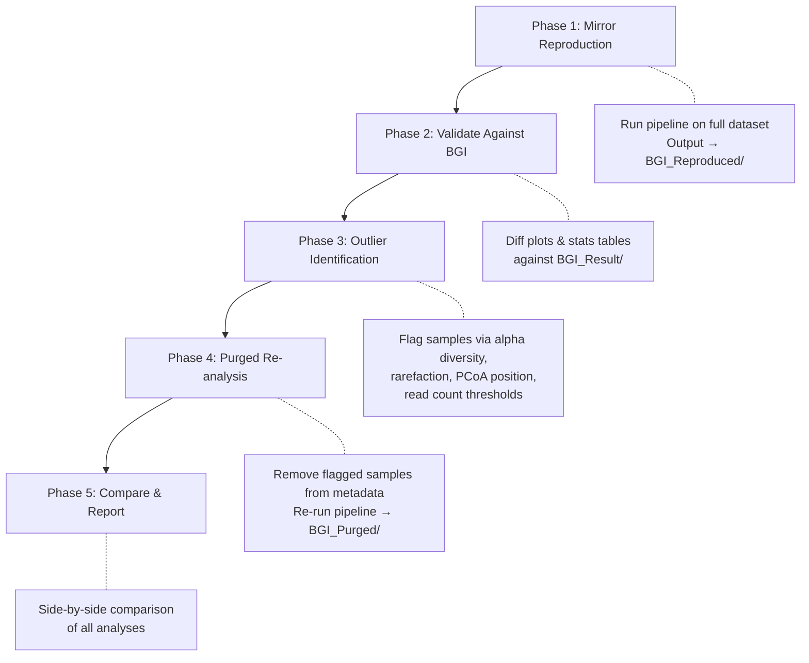

# Answers to Your Five Questions

---

## Q1: Can my laptop handle the 100-iteration bootstrapped PCoA?

**Yes, absolutely — without breaking a sweat.**

Let's break down what the 100-iteration bootstrapped PCoA actually does per iteration:

1. **Rarefaction** (`rrarefy`): Subsample a 51-sample × ~5,358 OTU matrix — this is a simple random draw
2. **Bray-Curtis distance** (`vegdist`): Compute a 51×51 pairwise distance matrix — 1,275 pairwise comparisons
3. **PCoA** (`cmdscale`): Eigendecomposition of a 51×51 matrix to extract 2 axes

That's it. Each iteration operates on a **51×51 matrix** — not a genomics-scale problem at all. The Procrustes alignment step is equally trivial (it's just rotating/scaling 51 points in 2D space to minimize sum-of-squares displacement).

**Rough estimate**: On any modern laptop, 100 iterations should complete in **5–30 seconds** depending on your CPU. Your dataset has:
- **51 samples** (tiny for ordination)
- **~5,358 OTUs** (moderate, but rarefaction + distance calculation is fast)

> [!TIP]
> For context, this kind of bootstrapped PCoA only becomes a performance concern when you have thousands of samples (e.g., large-scale human gut microbiome studies with 10,000+ subjects). At 51 samples, even 1,000 iterations would finish in under a minute.

The most computationally expensive scripts in your pipeline are actually:
- **Script 06** (Random Forest with 10×10 CV on ~5,000 features) — a few minutes
- **Script 07** (Shannon rarefaction at 50 depth steps × 51 samples) — a minute or two
- **Script 13** (Spearman correlation p-values for all OTU pairs) — depends on how many pass filtering

None of these are laptop-breaking.

---

## Q2: Complete R Library Inventory

Here is every R package required across all 19 scripts, organized by installation source:

### From CRAN (`install.packages()`)

| Package | Used By | Purpose |
|---------|---------|---------|
| **vegan** | 01, 02, 06, 07, 09, 11, 17, 18 | Community ecology: diversity indices, rarefaction, distance matrices, ordination (PCoA, NMDS, RDA/CCA, DCA), PERMANOVA, ANOSIM, MRPP |
| **ggplot2** | 01–08, 10–12, 14–15, 17–18 | All plotting |
| **reshape2** | 01, 03, 05, 15, 16 | `melt()` for converting wide → long format for ggplot |
| **ggpubr** | 01 | `stat_compare_means()` for overlaying p-values on boxplots |
| **pheatmap** | 03, 13, 16 | Heatmaps with hierarchical clustering |
| **randomForest** | 06 | Random Forest classification |
| **caret** | 06 | Cross-validation framework (10×10 repeated CV) |
| **pROC** | 06 | ROC curves and AUC calculation |
| **ape** | 17 | Phylogenetic tree reading (`read.tree`), tip pruning |
| **igraph** | 13 | Network construction and visualization |
| **cluster** | 14 | PAM clustering for enterotype classification |
| **ade4** | 14 | Ecological multivariate analysis |
| **VennDiagram** | 10 | Venn diagrams (≤5 groups) |
| **UpSetR** | 10 | UpSet plots (alternative to Venn for >5 groups) |
| **scales** | 13 | `rescale()` for node sizing in network plots |
| **futile.logger** | 10 | Suppressing VennDiagram's verbose logging |

### From Bioconductor (`BiocManager::install()`)

| Package | Used By | Purpose |
|---------|---------|---------|
| **phyloseq** | 17 | UniFrac distance computation (requires OTU table + tree + metadata as a unified object) |
| **mixOmics** | 12 | PLS-DA supervised classification |
| **BiocManager** | 12, 17 | Meta-installer for Bioconductor packages |

### One-liner to install everything

```r
# CRAN packages
install.packages(c(
  "vegan", "ggplot2", "reshape2", "ggpubr", "pheatmap",
  "randomForest", "caret", "pROC", "ape", "igraph",
  "cluster", "ade4", "VennDiagram", "UpSetR", "scales",
  "futile.logger"
))

# Bioconductor packages
if (!requireNamespace("BiocManager", quietly = TRUE))
  install.packages("BiocManager")
BiocManager::install(c("phyloseq", "mixOmics"))
```

> [!NOTE]
> Several scripts already include `requireNamespace()` guards that auto-install missing packages at runtime (scripts 06, 10, 12, 13, 14, 17). But installing everything upfront avoids mid-run interruptions.

---

## Q3: Strategy — Reproduce First, Then Purge Outliers

**Your instinct is exactly right.** This is the gold-standard approach in computational biology, and I strongly endorse it. Here's why and how:

### Why reproduce first?

1. **Validation**: If your pipeline produces results that match BGI's outputs, you *know* your code is correct before you start modifying inputs
2. **Debugging baseline**: Any discrepancy between your results and BGI's tells you something about either the pipeline or the data — and you want to resolve that *before* introducing the additional variable of outlier removal
3. **Publication defensibility**: You can show reviewers "our pipeline faithfully reproduces the commercial results, and here's what changes when we remove problematic samples"

### Recommended workflow



### Concrete implementation

I'd suggest structuring your output directories like this:

```
BGI Amplicon Workflow/
├── BGI_Result/              # Original BGI deliverables (READ-ONLY, never touch)
├── BGI_Reproduced/          # Your Phase 1 mirror output
│   ├── Alpha_Box/
│   ├── Beta/
│   └── ...
├── BGI_Purged/              # Your Phase 4 outlier-removed output
│   ├── Alpha_Box/
│   ├── Beta/
│   └── ...
├── analysis/                # R scripts (modify output_dir base path)
├── metadata.tsv             # Full metadata (51 samples)
└── metadata_purged.tsv      # Filtered metadata (outliers removed)
```

To switch between reproduction and purged mode, you'd only need to change **two variables** in `00_run_all_groups.R`:
- `meta_file` → point to `metadata.tsv` or `metadata_purged.tsv`
- The base output path prefix

### How to identify outliers

Before purging, you should establish clear, defensible criteria. Common approaches:

| Method | What It Catches | Script |
|--------|----------------|--------|
| **Read count threshold** | Samples with abnormally low sequencing depth | Check `colSums(otu)` in any script |
| **Alpha diversity extremes** | Samples with abnormally low/high richness | Script 01 output |
| **Rarefaction plateau** | Samples that never plateau (undersampled) | Script 07 output |
| **PCoA/NMDS outliers** | Samples that cluster far from their group | Scripts 02, 17, 18 |
| **Good's Coverage** | Samples with <95% coverage (insufficient depth) | Script 01 output |

> [!IMPORTANT]
> Document your outlier criteria *before* looking at the results. Deciding thresholds after seeing which samples would be removed introduces bias. Write your criteria first, apply them mechanically.

### For future projects

Once you've validated the pipeline on this dataset, you'll have:
- A tested, working codebase
- Confidence in interpreting the outputs
- A template you can copy and adapt (just swap in new OTU tables and metadata)

This is exactly how bioinformatics skills compound over time.

---

## Q4: Why does BGI run PCA when they already have PCoA and NMDS?

Excellent question — this is a common source of confusion. They look similar visually (scatter plots with axis labels), but they answer **fundamentally different mathematical questions**.

### The three methods compared

| | PCA | PCoA | NMDS |
|---|---|---|---|
| **Input** | Raw abundance matrix (samples × features) | Any distance/dissimilarity matrix | Any distance/dissimilarity matrix |
| **Distance assumed** | Euclidean (implicitly) | User's choice (Bray-Curtis, UniFrac, Pearson, etc.) | User's choice |
| **What it preserves** | Maximum variance in original feature space | Actual pairwise distances | Rank-order of pairwise distances |
| **Axes meaningful?** | Yes — loadings tell you *which OTUs* drive separation | Yes — eigenvalues give % variance explained | No — axes are arbitrary; only relative positions matter |
| **Metric?** | Yes (metric ordination) | Yes (metric ordination) | No (non-metric) |
| **Stress/fit** | Not applicable | Negative eigenvalues can occur (non-Euclidean distances) | Stress value quantifies fit |

### Why BGI includes all three

**PCA** answers: *"Which specific OTUs are responsible for the variance pattern?"*
- PCA operates directly on the abundance matrix, so you get **loadings** — a weight for each OTU on each axis. This tells you *which species drive the group separation*.
- That's something you **cannot get** from PCoA or NMDS, because those methods discard the original feature space when they compute pairwise distances.

**PCoA** answers: *"How do samples relate to each other using an ecologically appropriate distance?"*
- Bray-Curtis distance accounts for the compositional nature of microbiome data (it handles zeros well, isn't dominated by abundant species). Euclidean distance (which PCA uses) is known to be problematic for species abundance data — it overweights rare species and double-zeros.

**NMDS** answers: *"Can we represent the rank-ordering of sample dissimilarities faithfully in 2D?"*
- NMDS is the most flexible because it only preserves *ranks* of distances, not actual distances. This makes it robust to non-linear relationships. The stress value tells you how well the 2D representation captures the high-dimensional reality.

### The practical insight

Think of it this way:
- PCoA and NMDS tell you **"are my groups different?"** (using ecologically sound distances)
- PCA tells you **"what makes my groups different?"** (which OTUs contribute most)

That's why BGI, and most amplicon microbiome papers, include all three. They're complementary, not redundant.

> [!TIP]
> In your own publications, if space is limited, PCoA (Bray-Curtis) + PERMANOVA is the minimum standard for beta diversity. Include PCA only if you want to discuss which specific taxa drive the separation. NMDS is a good supplement when your PCoA has negative eigenvalue issues (which happens often with UniFrac distances).

---

## Q5: The OTU tree for UniFrac — what if we don't have one?

### Good news: you *do* have them

I searched your workspace and found that BGI provided **both** tree types for all 11 comparisons:

**OTU-level trees** (in `Beta/<comparison>/`):
- `A-B.OTU_final_phylogeny_tree.txt`
- `A-B-C.OTU_final_phylogeny_tree.txt`
- `A-B-C-D-E-F-G-H-I-J-K-L-M-N-O-P-Q.OTU_final_phylogeny_tree.txt` ← all-sample tree
- ... and all 8 other comparisons

**Genus-level trees** (in `Genus_Tree/`):
- All 11 comparison-specific genus trees ✅

So script 17's fallback chain will find the correct tree at step 1 (comparison-specific OTU tree) for every comparison. You're fully covered.

### But what if you *didn't* have one? (important for future projects)

Ideally, yes, the all-sample OTU tree is the gold standard input. It's built by:

1. Taking the representative sequences for all OTUs (`OTU_final.fasta` — you have this, 2.3 MB)
2. Aligning them with MAFFT or muscle
3. Building a phylogenetic tree with FastTree

If you ever need to build one yourself (e.g., for a future project or after merging datasets), the commands would be:

```bash
# Align OTU representative sequences
mafft --auto OTU_final.fasta > OTU_aligned.fasta

# Build approximate ML tree (very fast, suitable for UniFrac)
FastTree -gtr -nt OTU_aligned.fasta > OTU_phylogeny_tree.nwk
```

This takes a few minutes on a laptop for ~5,000 OTUs and produces a Newick-format tree that `ape::read.tree()` can load directly.

### Why does it matter whether the tree is comparison-specific or global?

- **Comparison-specific tree**: Built only from OTUs present in the compared groups. The phylogenetic distances are calibrated to that specific subset. This is what BGI provides.
- **Global (all-sample) tree**: Built from all OTUs across all samples. When you prune it to a comparison subset, the branch lengths retain the full evolutionary context.

For your **Phase 1 reproduction**, using BGI's comparison-specific trees is correct — it matches what they did. For your **Phase 4 purged analysis**, I'd recommend using the all-sample tree and letting script 17's pruning step handle the subsetting, since your sample composition will differ from BGI's original comparisons after outlier removal.

> [!IMPORTANT]
> The critical requirement is that **OTU IDs in the tree tip labels match the row names in your OTU table**. Script 17 checks this and reports the overlap count. If you see "Too few shared OTUs" errors, it's almost always an ID mismatch (e.g., `OTU_1` vs `OTU1` vs `denovo1`).
