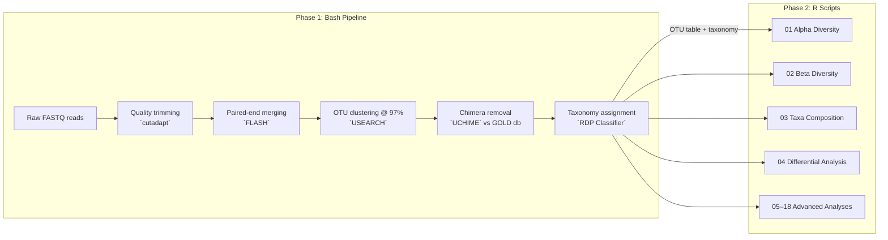

# BGI Amplicon Pipeline — Complete Input/Output & Workflow Guide

## The Big Picture

Your pipeline has **two phases** that hand off to each other:

**Phase 1** (`amplicon_pipeline.sh`) processes raw sequencing reads into structured tables. **Phase 2** (the 19 R scripts) consumes those tables to produce all statistical analyses and plots.

---

## All Required Input Files

Every R script needs input files. Here is the **complete inventory**, organized by which scripts consume them and whether they actually exist in your workspace right now.

### Tier 1: Universal Inputs (used by nearly every script)

| File | Path | Used By | Status |
|------|------|---------|--------|
| **OTU abundance table** | `BGI_Result/OTU/OTU_table_for_biom.txt` | Scripts 01–04, 06–14, 17, 18 | ✅ Exists (997 KB) |
| **Metadata mapping** | `metadata.tsv` | All 19 scripts | ✅ Exists (402 B) |

> [!IMPORTANT]
> These two files are the backbone. If either is missing or malformed, nothing runs.

The OTU table is a matrix where **rows = OTUs** and **columns = samples**, with raw read counts. It also carries a `taxonomy` column that the scripts strip out before analysis. The metadata maps each SampleID → Group letter.

---

### Tier 2: Taxonomy File (used by composition & differential scripts)

| File | Path | Used By | Status |
|------|------|---------|--------|
| **OTU taxonomy assignments** | `BGI_Result/OTU/OTU_taxonomy.xls` | Scripts 03, 04 | ✅ Exists (425 KB) |

This file contains the full 7-level taxonomic string for each OTU (Kingdom → Species), assigned by the RDP Classifier at 60% confidence. Scripts 03 and 04 parse this to aggregate OTU counts at Phylum, Class, Order, Family, Genus, and Species levels.

---

### Tier 3: Pre-aggregated Taxonomic Tables (L2–L7)

| File | Path | Used By | Status |
|------|------|---------|--------|
| `OTU_table_L2.txt` | `BGI_Result/OTU/` | 04, 08, 15 | ✅ Exists |
| `OTU_table_L3.txt` | `BGI_Result/OTU/` | 04, 08, 15 | ✅ Exists |
| `OTU_table_L4.txt` | `BGI_Result/OTU/` | 04, 08, 15 | ✅ Exists |
| `OTU_table_L5.txt` | `BGI_Result/OTU/` | 04, 08, 15 | ✅ Exists |
| `OTU_table_L6.txt` | `BGI_Result/OTU/` | 04, 08, 14, 15 | ✅ Exists |
| `OTU_table_L7.txt` | `BGI_Result/OTU/` | 04, 08, 15 | ✅ Exists |

These are the OTU table pre-collapsed at each taxonomic level (L2=Phylum through L7=Species). BGI generates these from the BIOM file. Three scripts use them:

- **Script 04** runs differential tests (Wilcoxon/Kruskal-Wallis) at every taxonomic level
- **Script 08** runs PCA at every taxonomic level
- **Script 14** uses L6 (Genus) for enterotype classification
- **Script 15** generates stacked barplots at every level

> [!NOTE]
> Scripts gracefully skip any missing level file with a "file not found" message — they won't crash.

---

### Tier 4: Phylogenetic Trees (for UniFrac)

| File | Path | Used By | Status |
|------|------|---------|--------|
| Genus-level trees (×11) | `BGI_Result/Genus_Tree/*.phylogeny.tree` | Script 17 | ✅ All 11 exist |
| OTU-level trees | `BGI_Result/Beta/<comp>/*.phylogeny_tree.txt` | Script 17 | ⚠️ Need to verify |

Script 17 (`17_unifrac_beta.R`) is the most complex for input resolution. It has a **5-level fallback search** for phylogenetic trees:
1. Comparison-specific OTU tree in `Beta/<comp>/`
2. Comparison-specific genus tree in `Genus_Tree/`
3. All-sample OTU tree
4. All-sample genus tree
5. Any `.tree` file it can find

Your `Genus_Tree/` directory has all 11 comparison trees ready to go.

---

### Tier 5: PICRUSt2 Functional Predictions

| File | Path | Used By | Status |
|------|------|---------|--------|
| KEGG L2 pathways | `BGI_Result/Picrust/Function_Prdeict/KO/ko_Level2_Function.xls` | Script 05 | ⚠️ Need to verify |
| KEGG L1, L3 pathways | `BGI_Result/Picrust/Function_Prdeict/KO/` | Script 16 | ⚠️ Need to verify |
| COG predictions | `BGI_Result/Picrust/Function_Prdeict/COG/` | Script 16 | ⚠️ Need to verify |
| EC predictions | `BGI_Result/Picrust/Function_Prdeict/EC/` | Script 16 | ⚠️ Need to verify |
| MetaCyc predictions | `BGI_Result/Picrust/Function_Prdeict/METACYC/` | Script 16 | ⚠️ Need to verify |

Script 05 does basic KEGG barplots. Script 16 expands this across all four pathway databases (KO, COG, EC, MetaCyc), adding heatmaps and differential testing.

> [!TIP]
> Both scripts 05 and 16 check `file.exists()` before proceeding and will print a "not found" message rather than crashing if the PICRUSt2 output is missing.

---

## Script-by-Script Data Flow

Here is what each script **reads**, **computes**, and **outputs**:

### Core Diversity & Composition (Scripts 01–03)

| Script | Reads | What It Does | Key Outputs |
|--------|-------|--------------|-------------|
| **01** Alpha Diversity | OTU table, metadata | Calculates Sobs, Chao1, ACE, Shannon, Simpson (dominance convention), Good's Coverage on rarefied data. Auto-selects Wilcoxon (2 groups) or Kruskal-Wallis (≥3). | `Alpha_Box/` — boxplots + summary table |
| **02** Beta Diversity | OTU table, metadata | Rarefies → Bray-Curtis distance → 100-iteration bootstrapped PCoA with Procrustes alignment. Also Pearson dissimilarity PCoA. PERMANOVA. NMDS. | `Beta/` — PCoA plots, NMDS plots, distance matrices, PERMANOVA tables |
| **03** Taxa Composition | OTU table, taxonomy, metadata | Parses 7-level taxonomy strings, aggregates to Phylum, computes relative abundance, Top-10 stacked barplots, log10 heatmap with hierarchical clustering. | `Barplot/` + `Heatmap/` |

### Statistical Testing (Scripts 04, 09)

| Script | Reads | What It Does | Key Outputs |
|--------|-------|--------------|-------------|
| **04** Differential | OTU table, taxonomy, metadata, L2–L7 tables | Pre-filters rare OTUs (prevalence ≥10% or mean rel. abund. >0.01%), Wilcoxon/Kruskal-Wallis with BH-FDR correction, log₂ fold-change, LEfSe input preparation. Also runs multi-level differential at every taxonomic rank. | `Diff/` — stats tables, boxplots, LEfSe input |
| **09** Similarity Tests | OTU table, metadata | Rarefies → Bray-Curtis → ANOSIM (R statistic) + MRPP (A statistic, chance-corrected within-group agreement). | `SimilarityAnalysis/` — MRPP + ANOSIM results |

### Ordination & Classification (Scripts 06, 08, 12)

| Script | Reads | What It Does | Key Outputs |
|--------|-------|--------------|-------------|
| **06** Advanced (RF + RDA/CCA) | OTU table, metadata | **Random Forest**: 10×10 CV, ROC/AUC for binary, Hand-Till AUC for multi-class. **DCA gradient-length selection**: gradient >4 SD → CCA (unimodal), ≤4 → RDA (linear). | `Advanced/` — RF importance, ROC curve, RDA/CCA plot, DCA log |
| **08** PCA | OTU table, metadata, L2–L7 tables | Standard PCA (`prcomp`, centered+scaled) at OTU level AND every taxonomic level. | `PCA/` — scatter plots per level |
| **12** PLS-DA | OTU table, metadata | Supervised PLS-DA via `mixOmics`. Maximises group separation. | `PLSDA/` — ordination plot |

### Community Structure (Scripts 07, 10, 11, 14)

| Script | Reads | What It Does | Key Outputs |
|--------|-------|--------------|-------------|
| **07** Rarefaction | OTU table, metadata | Rarefaction curves for both Observed Species and Shannon at 50 stepped depth intervals. | `Alpha_Rarefaction/` — curve plots |
| **10** Venn/Flower | OTU table, metadata | OTU presence/absence per group → shared/unique OTU counts. Venn diagram (≤5 groups), UpSet plot (any number). Core/pan genome summary. | `Venn/` + `Flower/` |
| **11** Rank Abundance | OTU table, metadata | Per-sample rank-abundance curves (log-scale) + species accumulation curve (100 permutations). | `OTU_Rank/` + `Cumulative_Curve/` |
| **14** Enterotypes | OTU table (or L6), metadata | Jensen-Shannon Divergence → PAM clustering → optimal K by silhouette width. PCoA visualization of enterotype clusters. | `Enterotypes/` — assignments, PCoA, top-30 taxa |

### Ecological Networks (Script 13)

| Script | Reads | What It Does | Key Outputs |
|--------|-------|--------------|-------------|
| **13** Network | OTU table | Filters OTUs >0.5% relative abundance, Spearman correlation with BH-FDR correction, correlation heatmap (\|ρ\|>0.2), co-occurrence network (\|ρ\|>0.6, P<0.05) via igraph. | `Network/` — heatmap, network graph, edge list |

### Taxonomy Expansion (Script 15)

| Script | Reads | What It Does | Key Outputs |
|--------|-------|--------------|-------------|
| **15** Multi-level Barplots | metadata, L2–L7 tables | Sample-level AND group-level stacked barplots at all 6 taxonomic levels. Taxa <0.5% consolidated to "Others". | `Barplot/` — 12 barplot files |

### Functional Prediction (Scripts 05, 16)

| Script | Reads | What It Does | Key Outputs |
|--------|-------|--------------|-------------|
| **05** Function Prediction | KEGG L2 table, metadata | Top-20 KEGG pathway barplot (sample + group level). | `Picrust/` — barplots |
| **16** Function Expansion | metadata, KO/COG/EC/MetaCyc tables | Extends script 05 across all PICRUSt2 databases. Barplots, heatmaps, and Wilcoxon/Kruskal-Wallis differential testing per database per level. | `Picrust/Function_Prdeict/*/barplot/`, `Function_Diff/` |

### Phylogenetic Beta Diversity (Scripts 17, 18)

| Script | Reads | What It Does | Key Outputs |
|--------|-------|--------------|-------------|
| **17** UniFrac Beta | OTU table, metadata, phylogenetic tree | Prunes OTU table to match tree tips → rarefies → builds `phyloseq` object → weighted & unweighted UniFrac + Bray-Curtis. PCoA, UPGMA trees, beta boxplots, PERMANOVA per metric. | `Beta/R_Analysis/` |
| **18** NMDS | OTU table, metadata | Rarefies → Bray-Curtis → standalone NMDS with stress annotation. | `NMDS/` |

---

## How `00_run_all_groups.R` Ties It All Together

The orchestrator defines **11 group comparisons** matching BGI's original report:

| # | Comparison | Groups | Purpose |
|---|-----------|--------|---------|
| 1 | A-B | A, B | Pairwise |
| 2 | A-C | A, C | Pairwise |
| 3 | B-C | B, C | Pairwise |
| 4 | A-B-C | A, B, C | 3-way within location/treatment |
| 5 | A-B-C-D-E-P | A–E, P | Extended + control |
| 6 | F-G-H-I-J-P | F–J, P | Extended + control |
| 7 | K-L-M-N-O-P-Q | K–O, P, Q | Extended + controls |
| 8 | A-B-C-D-E-F-G-H-I-J-P | A–J, P | Two locations + control |
| 9 | A-B-C-D-E-K-L-M-N-O-P-Q | A–E, K–Q | Two locations + controls |
| 10 | P-Q | P, Q | Control comparison |
| 11 | All groups | A–Q | Global analysis |

For each comparison, the master script:
1. Subsets metadata to only the relevant samples
2. Sets `meta_file` and `output_dir` (with comparison suffix) in a sandboxed environment
3. Sources scripts 01–18 sequentially inside that sandbox
4. Catches and logs any errors without stopping

This means **each analysis is executed up to 11 times** — once per comparison — producing comparison-specific output directories.

---

## Summary: What You Need Before Running

> [!IMPORTANT]
> **Minimum to run the core pipeline (scripts 01, 02, 06–14, 17, 18):**
> - `metadata.tsv` ✅
> - `BGI_Result/OTU/OTU_table_for_biom.txt` ✅
>
> **Additionally for composition & differential (scripts 03, 04):**
> - `BGI_Result/OTU/OTU_taxonomy.xls` ✅
>
> **Additionally for multi-level analyses (scripts 04, 08, 14, 15):**
> - `BGI_Result/OTU/OTU_table_L2.txt` through `L7.txt` ✅
>
> **Additionally for UniFrac (script 17):**
> - Phylogenetic tree files in `Genus_Tree/` or `Beta/` ✅
>
> **Additionally for functional prediction (scripts 05, 16):**
> - PICRUSt2 output in `Picrust/Function_Prdeict/` ⚠️ Needs verification

All your core inputs are present. You're in good shape to run this pipeline.
